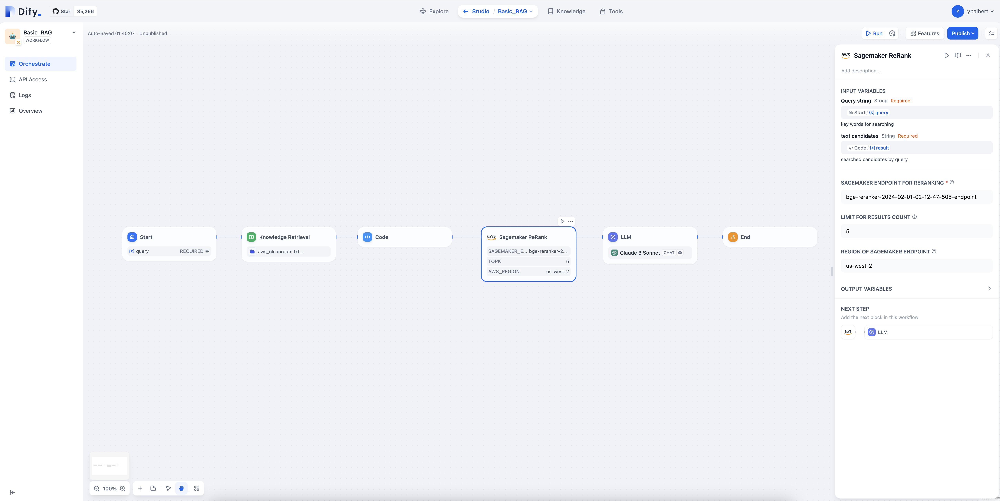
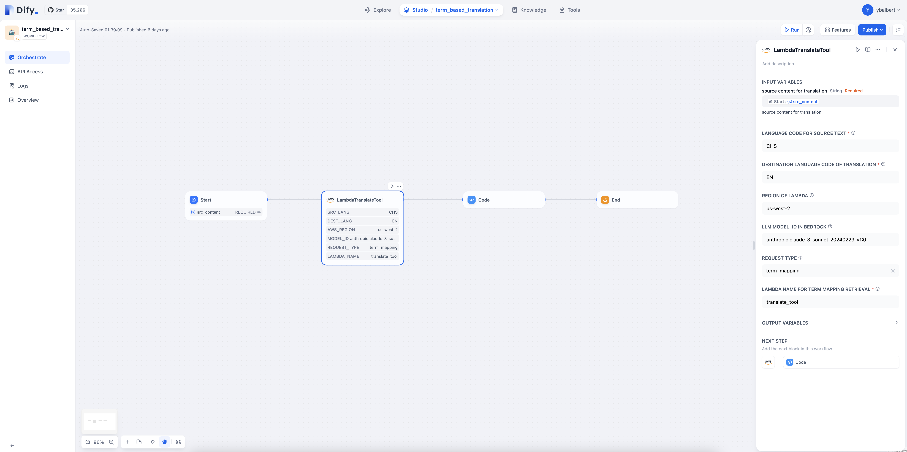

    &nbsp<strong>English</strong>&nbsp ｜ <a href="README_ZH.md"><strong>简体中文</strong></a>&nbsp 

 

# Dify AWS Tools

## Introduction
This repo provide some sample code to show how to integrate some tools which based on AWS Service to [Dify](https://github.com/langgenius/dify)

## Tools
- Text Rerank Tool (based on SageMaker)
    
- Term mapping Retrieval Tool (Translation scenario, based on Lambda and Dynamodb)
    

## Prerequisites
- Dify Environment
- Some experience with AWS
- Basic experience with Linux environments
- Basic experience with Dify

## Target Audience
- Dify / AWS User
- GenAI Developer